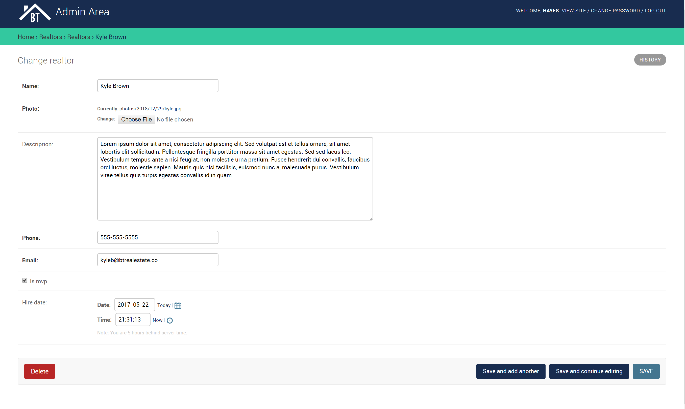

# BT Real Estate Project

A side project that is an example of using HTML, CSS, and Javascript on the front-end and incorporating Python and Django on the backend to build database functionality with PostgreSQL and help from pgAdmin4.

## Languages
+ HTML
+ CSS
+ JavaScript
+ Python with Django Libaries
+ PostGreSQL Database with pgAdmin4 for visuals

## Features
  + You can login as a user and select properties and make 'inquiries' about them. This sends an email to the realtor of the property.
    There is also a dashboard provided that lists all of your inquries
  + A lot of dynamic content with using information from the PostgreSQL database and Django
  + On the Admin side you can add realtors and properties and the front end updates automatically using the dynamic functionality.
    + You can also select the 'Seller of the Month'
    + You filter through the listings easily to make any changes necessary
  + Users on the front end can search through listings as well
  + You can make inquiries without logging in as well
  
 ## Screenshoots
 
 ### The Main Webpage

### Example of Creating a Listing from Admin Area

### The Listing Page

### The Home for the Admin Area

### Example of Creating a Realtor from Admin Area

### Listings from Admin Area

### Inquiries from Admin Area

### Example of User Dashboard and Inquiries made
You will notice if you go back to the inquiries picture from the admin area that 
all of the inquiries made from Kathy appear here in her inquiry listings as well

### Example of User Loggin in

